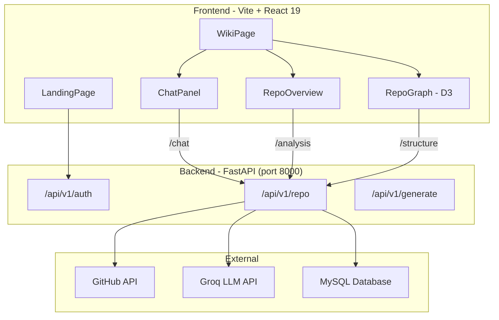

# RepoTalk 💬🕸️

RepoTalk is a full-stack application that allows you to chat with any public GitHub repository using AI. It fetches a repository's source code, indexes it into a local vector store, and uses large language models (LLMs) to answer natural-language questions about the codebase.

It also features an **AI-powered architecture diagram generator** that visualizes repository structure using interactive D3.js force-directed graphs and Mermaid.js diagrams.

## 🚀 Features

- **Chat with Codebases**: Ask questions about the repo architecture, files, or specific issues.
- **RAG Architecture**: Uses FAISS and HuggingFace sentence-transformers (`all-MiniLM-L6-v2`) to retrieve the most relevant code chunks for context.
- **Interactive Repository Graph**: Visualize the repo's file structure with an interactive force-directed D3 graph.
- **Mermaid AI Analysis**: Automatically generate architectural diagrams and sequence diagrams to understand data flow.
- **Google OAuth**: Secure login flow with JSON Web Tokens (JWT).
- **Issue-Aware Mode**: Ask about a specific GitHub issue (e.g., "explain issue #42") and RepoTalk will pull the issue context automatically.

## 🛠️ Tech Stack

- **Frontend**: React 19, Vite, D3.js, Mermaid.js, React Markdown
- **Backend**: Python, FastAPI, Uvicorn, SQLAlchemy
- **Database**: MySQL (via PyMySQL)
- **AI / LLMs**: Groq API (Llama 3.3 70B), LangChain
- **Embeddings**: HuggingFace (`sentence-transformers`)
- **Vector DB**: FAISS (CPU)
- **Authentication**: Google OAuth 2.0, JWT (`python-jose`)

## 🏗️ Architecture



## ⚙️ Setup Instructions

### 1. Backend Setup

The backend uses FastAPI and requires a Python 3.10+ environment.

```bash
cd backend

# Create and activate a virtual environment
python -m venv venv
# On Windows:
.\venv\Scripts\Activate
# On Mac/Linux:
source venv/bin/activate

# Install dependencies
pip install -r requirements.txt
```

### 2. Environment Variables

Create a `.env` file in the `backend/` directory based on `.env.example`:

```env
# Google OAuth
GOOGLE_CLIENT_ID=your-google-client-id.apps.googleusercontent.com
GOOGLE_CLIENT_SECRET=your-google-client-secret
GOOGLE_REDIRECT_URI=http://localhost:8000/api/v1/auth/google/callback

# Security
SECRET_KEY=generate-a-strong-random-secret-key

# Database
DATABASE_URL=mysql+pymysql://<user>:<password>@<host>:<port>/<database>

# AI & APIs
GROQ_API_KEY=your_groq_api_key
GITHUB_TOKEN=your_github_pat # Optional, but highly recommended to avoid rate limits

# App settings
FRONTEND_URL=http://localhost:5173
ENVIRONMENT=development
```

### 3. Run the Servers

Start the **backend** (make sure your virtual environment is active):
```bash
cd backend
uvicorn app.main:app --reload
```

Start the **frontend**:
```bash
cd frontend
npm install
npm run dev
```

Open `http://localhost:5173` in your browser.

## 📝 Important Notes

- **GitHub Rate Limits**: Without a `GITHUB_TOKEN`, the GitHub API enforces a strict rate limit (60 requests per hour). Since loading a repository fetches multiple files, you will easily hit this limit. **Adding a GitHub Personal Access Token (PAT) is highly recommended.**
- **Diagram Generation**: The Mermaid validation service requires [Bun](https://bun.sh/) to be installed on your machine. If Bun is not found, the app will skip validation and attempt to render the generated Markdown directly.