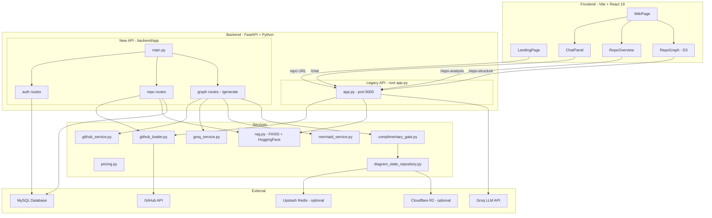

# 🔍 RepoTalk — Complete Project Analysis Report

## 1. What Is RepoTalk?

**RepoTalk** is a full-stack web application that lets users **chat with any public GitHub repository** using AI. It fetches a repo's source code, indexes it into a vector store, and then uses an LLM (Groq / Llama) to answer natural-language questions about the codebase.

It also includes a **diagram generation** subsystem (forked/inspired from [GitDiagram](https://gitdiagram.com)) that creates Mermaid architecture diagrams from a repo's file tree and README.

---

## 2. Architecture Overview



---

## 3. Project Structure

| Layer | Path | Purpose |
|---|---|---|
| **Root (Legacy)** | [app.py](file:///d:/RepoTalk/app.py), [github_loader.py](file:///d:/RepoTalk/github_loader.py), [rag.py](file:///d:/RepoTalk/rag.py) | The **original monolithic** FastAPI app — still what the frontend connects to |
| **Backend (New)** | [backend/app/](file:///d:/RepoTalk/backend/app) | A **restructured version** with auth, DB, per-user state, and diagram generation |
| **Frontend** | [frontend/src/](file:///d:/RepoTalk/frontend/src) | Vite + React 19 SPA with D3 graph, Mermaid diagrams, and chat panel |

---

## 4. How It Works (Flow-by-Flow)

### 4.1 Repository Loading (`/load-repo`)
1. User enters a GitHub URL on the landing page
2. Frontend calls `POST /load-repo` on the **legacy** `app.py`
3. Backend extracts `owner/repo`, checks local disk cache
4. If not cached: fetches metadata via GitHub API, fetches file tree, downloads all source files concurrently (15 threads)
5. Builds a FAISS vector store using `sentence-transformers/all-MiniLM-L6-v2` embeddings
6. Saves the FAISS index + metadata to `repository_db/` on disk
7. Returns metadata to frontend, which switches to the WikiPage view

### 4.2 AI Chat (`/chat`)
1. User types a question in the ChatPanel
2. Frontend calls `POST /chat` on the **legacy** `app.py`
3. Backend checks if query mentions a GitHub issue (e.g., "explain issue #42")
4. **Issue-aware mode**: fetches the issue from GitHub, does similarity search with issue text as the query
5. **Normal mode**: does similarity search with user's question, retrieves top 7 chunks
6. Builds a prompt with the retrieved context + user question
7. Sends to Groq API (Llama 4 Maverick model in legacy, Llama 3.3 70b in new backend)
8. Returns the LLM response to frontend, rendered as Markdown

### 4.3 AI Analysis (`/repo-analysis`)
1. User clicks "Generate Analysis" on the Overview tab
2. Sends first 15 cached document samples to the LLM with a detailed prompt
3. Asks the LLM to produce a structured analysis with **two Mermaid diagrams**
4. Frontend renders Markdown + detects `mermaid` code blocks → renders them via Mermaid.js

### 4.4 Architecture Diagram (`/api/v1/generate/stream`)
1. User switches to the "Architecture" tab and clicks Generate.
2. Frontend connects to the new SSE streaming endpoint `/api/v1/generate/stream`.
3. Backend checks the global `DiagramCache` (MySQL) to see if the diagram was already generated for this repo. If so, it instantly returns the cached Mermaid diagram, skipping LLM calls.
4. If not cached, it fetches GitHub data (file tree + README).
5. Sends data to the Groq LLM (e.g. `openai/gpt-oss-20b`) in two stages: explanation → structured graph plan.
6. Validates the graph (retries up to 3 times if invalid).
7. Compiles into Mermaid syntax, validates syntax via an external Node.js script.
8. Streams progress and results to the frontend via Server-Sent Events (SSE).
9. Frontend renders the interactive Mermaid flowchart with panning, zooming, and a collapsible explanation panel.
10. The backend caches the successful diagram into the `DiagramCache` MySQL table for future requests.

### 4.6 Google OAuth Authentication — New Backend Only
1. `GET /api/v1/auth/google` redirects user to Google consent page
2. Google calls back with an authorization code
3. Backend exchanges code for token, fetches user profile
4. Upserts user in MySQL, creates JWT token (7-day expiry)
5. Redirects to frontend with token in URL query param

---

## 5. Tech Stack

| Category | Technology |
|---|---|
| **Frontend** | React 19, Vite 7, D3.js 7, Mermaid 11, react-markdown |
| **Backend** | Python, FastAPI, Uvicorn |
| **LLM** | Groq API (Llama 3.3 70B / Llama 4 Maverick) via LangChain |
| **Embeddings** | HuggingFace `all-MiniLM-L6-v2` (local) |
| **Vector Store** | FAISS (CPU) |
| **Database** | MySQL (via SQLAlchemy + PyMySQL) |
| **Auth** | Google OAuth 2.0 + JWT (python-jose) |
| **Cloud Storage** | Cloudflare R2 via boto3 (optional) |
| **Rate Limiting** | Upstash Redis REST (optional) |

---

## 6. Identified Problems & Issues

### 🔴 Critical Issues

#### 6.1 Two Separate Backends — Frontend Uses the Wrong One

> [!CAUTION]
> The frontend connects to the **legacy** `app.py` at `http://localhost:8000`, but the structured backend under `backend/` has all the new features (auth, DB, per-user repos). The two backends are **completely independent** — they don't share state, routes, or database connections.

- [RepoContext.jsx](file:///d:/RepoTalk/frontend/src/context/RepoContext.jsx#L5) hardcodes `API_BASE = 'http://localhost:8000'`
- It calls `/load-repo`, `/chat`, `/repo-analysis`, `/repo-structure` — these exist only in the **legacy** [app.py](file:///d:/RepoTalk/app.py)
- The new backend at `backend/app/main.py` serves routes under `/api/v1/repo/*` and `/api/v1/auth/*` — **the frontend never calls these**
- **Impact**: All user auth, MySQL persistence, chat history, and per-user repos are **completely unused** by the frontend

#### 6.2 `persist_successful_state` Missing Required Parameter (✅ Resolved)

- **Status:** Fixed. The missing `used_own_key` argument has been correctly added to the `persist_successful_state` call.

#### 6.3 `estimate` Variable Used But Never Defined (✅ Resolved)

- **Status:** Fixed. The `NameError` caused by referencing an undefined `estimate` variable has been replaced with `audit.get("estimatedCost", {})`.

#### 6.4 Diagram Generation Model Deprecation (✅ Resolved)

- **Status:** Fixed. The previously hardcoded `llama-3.3-70b-versatile` and `llama3-70b-8192` models were returning 404 errors. The configuration has been updated to use `openai/gpt-oss-20b`, matching the currently active models mapped to the backend's API environment.

#### 6.5 Global Mutable State in Legacy Backend (No Multi-User Support)

[app.py L38-41](file:///d:/RepoTalk/app.py#L38-L41) uses **global variables** for the currently loaded repo:
```python
vectorstore = None
current_repo = None
repo_metadata_cache = None
repo_documents_cache = []
```
**Impact**: If two users use the app simultaneously, one user's `/load-repo` call will overwrite the other's state. There is no session isolation.

---

### 🟠 Significant Issues

#### 6.6 `get_model()` Can Return `None`

In [model_config.py L33-39](file:///d:/RepoTalk/backend/app/services/model_config.py#L33-L39):
```python
def get_model(provider: AIProvider | None = None) -> str:
    resolved_provider = provider or get_provider()
    if resolved_provider == "groq":
        return _read_env("GROQ_MODEL") or DEFAULT_GROQ_MODEL
    # ← no else branch, falls through to...
    return _read_env("GROQ_MODEL") or DEFAULT_GROQ_MODEL
```
While this currently works because it falls through to the same default, the `AIProvider` literal only allows `"groq"` — the dead code after the `if` is confusing and error-prone if new providers are added.

#### 6.7 Hardcoded LLM Model in Legacy `app.py` Is Wrong/Outdated

[app.py L46](file:///d:/RepoTalk/app.py#L46) uses:
```python
model_name="meta-llama/llama-4-maverick-17b-128e-instruct"
```
This model may not be available on Groq's free tier or could be deprecated. The new backend uses `llama-3.3-70b-versatile`, creating inconsistency.

#### 6.8 No Error Handling for GitHub Rate Limits

The GitHub API calls in [github_loader.py](file:///d:/RepoTalk/github_loader.py) and [github_service.py](file:///d:/RepoTalk/backend/app/services/github_service.py) don't specifically handle 403 rate-limit responses. Without a `GITHUB_TOKEN`, the rate limit is **60 requests/hour**, which is easily exhausted when fetching file contents concurrently.

#### 6.9 `complimentary_gate.py` References "OpenAI" and "GitDiagram" — Identity Crisis

- [complimentary_gate.py L19-33](file:///d:/RepoTalk/backend/app/services/complimentary_gate.py#L19-L33) has messages like *"GitDiagram's free daily capacity..."* and references to "OpenAI" as a provider
- [graph.py L362](file:///d:/RepoTalk/backend/app/api/v1/routes/graph.py#L362) checks `if provider != "openai"` but the only supported provider is `"groq"`
- **Impact**: The complimentary gate will **always deny** if `COMPLIMENTARY_GATE_ENABLED=true` because the provider can never be "openai"

#### 6.9 CORS Configuration Mismatch

- **Legacy** [app.py L26](file:///d:/RepoTalk/app.py#L26): `allow_origins=["*"]` (wide open)
- **New backend** [main.py L31](file:///d:/RepoTalk/backend/app/main.py#L31): `allow_origins=[settings.FRONTEND_URL]` (restrictive)
- This means the new backend would reject requests from the frontend if the URL doesn't exactly match `FRONTEND_URL`.

#### 6.10 `allow_dangerous_deserialization=True` in FAISS Loading

Both [rag.py](file:///d:/RepoTalk/rag.py#L40) files use:
```python
FAISS.load_local(path, embeddings, allow_dangerous_deserialization=True)
```
This flag allows pickle deserialization which is a **remote code execution risk** if an attacker can write to the `repository_db/` directory.

---

### 🟡 Minor Issues & Code Smells

#### 6.11 Frontend Chat Calls `/chat` on Legacy API — No Auth

[ChatPanel.jsx L28](file:///d:/RepoTalk/frontend/src/components/ChatPanel.jsx#L28) calls:
```javascript
fetch(`${apiBase}/chat`, { ... })
```
This hits the legacy API which has **no authentication**. Anyone can query any loaded repo.

#### 6.12 `RepoGraph.jsx` Calls `/repo-structure` Without Auth

[RepoGraph.jsx L57](file:///d:/RepoTalk/frontend/src/components/RepoGraph.jsx#L57) calls the legacy API endpoint with no token. The new backend's repo routes require authentication.

#### 6.13 Chat Suggestions Array Never Rendered

[ChatPanel.jsx L56-63](file:///d:/RepoTalk/frontend/src/components/ChatPanel.jsx#L56-L63) defines a `suggestions` array but it's **never used** in the JSX — a dead variable.

#### 6.14 Duplicate Comment Blocks in `repo.py`

[repo.py L47-49](file:///d:/RepoTalk/backend/app/api/v1/routes/repo.py#L47-L49):
```python
# In-memory vectorstore cache  { repo_id → FAISS }
# ──────────────────────────────────────────────
# In-memory vectorstore cache  { repo_id → FAISS }
```
Duplicated comment block.

#### 6.15 `on_event("startup")` Is Deprecated

[main.py L40](file:///d:/RepoTalk/backend/app/main.py#L40) uses `@app.on_event("startup")` which is deprecated in modern FastAPI. Should use the `lifespan` context manager instead.

#### 6.16 No `.env` Validation at Startup for Legacy App

The legacy `app.py` only checks for `GROQ_API_KEY` but not for `GITHUB_TOKEN`. The new backend's `Settings` class validates all required fields at import time, but the legacy app has no such protection.

#### 6.17 Mermaid Validation Requires `bun` — Not Documented

[mermaid_service.py L44](file:///d:/RepoTalk/backend/app/services/mermaid_service.py#L44) needs `bun` installed to validate Mermaid syntax. If `bun` is missing, it silently skips validation. This dependency is nowhere in the README or requirements.

#### 6.18 Empty README

[README.md](file:///d:/RepoTalk/README.md) contains only `# RepoTalk` — no setup instructions, no architecture docs, no usage guide.

---

## 7. Summary Table

| # | Severity | Issue | Location |
|---|---|---|---|
| 6.1 | 🔴 Critical | Frontend uses legacy API, ignoring new backend entirely | `RepoContext.jsx`, `app.py` |
| 6.2 | 🔴 Critical | Missing `used_own_key` param in `persist_successful_state` call | `graph.py:800` |
| 6.3 | 🔴 Critical | Undefined `estimate` variable used in fallback cost calculation | `graph.py:793` |
| 6.4 | 🔴 Critical | Global mutable state — no multi-user support | `app.py:38-41` |
| 6.5 | 🟠 Significant | `get_model()` has dead code path | `model_config.py:33` |
| 6.6 | 🟠 Significant | Hardcoded LLM model may be unavailable | `app.py:46` |
| 6.7 | 🟠 Significant | No GitHub rate-limit handling | `github_loader.py` |
| 6.8 | 🟠 Significant | Complimentary gate always denies (OpenAI check on Groq) | `complimentary_gate.py`, `graph.py:362` |
| 6.9 | 🟠 Significant | CORS mismatch between legacy and new backend | `app.py:26`, `main.py:31` |
| 6.10 | 🟠 Significant | Dangerous deserialization flag on FAISS loading | `rag.py` |
| 6.11 | 🟡 Minor | No auth on chat endpoint | `ChatPanel.jsx:28` |
| 6.12 | 🟡 Minor | No auth on graph endpoint | `RepoGraph.jsx:57` |
| 6.13 | 🟡 Minor | Unused `suggestions` array | `ChatPanel.jsx:56` |
| 6.14 | 🟡 Minor | Duplicate comment | `repo.py:47-49` |
| 6.15 | 🟡 Minor | Deprecated `on_event` usage | `main.py:40` |
| 6.16 | 🟡 Minor | Missing env validation in legacy app | `app.py` |
| 6.17 | 🟡 Minor | Undocumented `bun` dependency | `mermaid_service.py` |
| 6.18 | 🟡 Minor | Empty README | `README.md` |

---

## 8. Recommendations (Priority Order)

1. **Unify the backends** — Retire the legacy `app.py` and point the frontend to the new `backend/app`. This is the single biggest improvement: it enables auth, per-user repos, chat history, and proper database persistence.

2. **Fix the runtime bugs** — The `persist_successful_state` missing param and undefined `estimate` variable will crash the diagram generation flow.

3. **Fix the complimentary gate** — Change the provider check from `"openai"` to `"groq"`, or remove it if not needed. Update the branding from "GitDiagram" to "RepoTalk".

4. **Add session isolation** — Either use the new per-user DB-backed approach, or at minimum use session-scoped state instead of globals.

5. **Add GitHub rate-limit handling** — Check `X-RateLimit-Remaining` headers and surface clear error messages.

6. **Write a proper README** — Include setup instructions, env configuration, and architecture docs.
